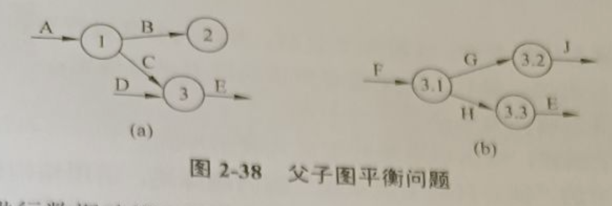

# 1.名词解释：可行性分析、需求获取、数据流图、状态转换图、数据字典、E-R模型。
当然，以下是对您提到的这些名词的简要解释：

1. **可行性分析**：这是软件开发的初步阶段，用于评估项目的可行性，包括技术、经济、操作和时间上的可行性。目的是确定项目是否值得继续进行。

2. **需求获取**：这是软件工程的一个关键过程，涉及与利益相关者（如用户、客户和其他利益相关者）沟通，以收集、识别和明确软件系统的需求和期望。

3. **数据流图**：也称为DFD（Data Flow Diagram），是一种图形工具，用于表示系统的数据流动和处理过程。它显示了数据如何在系统内部流动，以及与外部实体之间的交互。

4. **状态转换图**：这是一种描述系统行为和状态变化的图形表示方法。它显示了系统在不同的输入条件下如何从一个状态转换到另一个状态。

5. **数据字典**：它是一个集中存储和描述系统数据元素的文档或文件。数据字典为数据元素提供了定义、属性和其他相关信息。

6. **E-R模型**：也称为实体-关系模型，是一种用于描述实体之间关系的图形表示方法。它通常用于数据库设计，帮助设计师理解和定义实体及其属性，以及实体之间的关系。

这些名词在软件工程和系统设计中都是非常重要的概念，对于理解和实现复杂系统都有很大的帮助。

# 2. 单项选择题。
```
（1）软件需求工程的任务是（C）
A. 给出软件系统的设计方案
B. 对用户需求进行可行性分析
C. 回答软件系统“必须做什么”的问题
D. 明确用戸向題
```
```
（2） 结构化需求分析并建立（B）。
A. 数据模型、功能模型、行模型
C. 静态模型、动态模型、用例模型
B. E-R 模型、DFD 模型、数据字典
D. E-R 模型、DFD 模型、PDL
```
```
（3） E-R 模型包括（A）等组成部分。
A. 实体、属性、关系
B. 实体、属性、消息
C. 实体、控制、消息
D. 类、对象、关系
```
```
（4）在DFD 图的图形元素中，不受系统控制的元素是（B）。
A. 数据加工
B. 外部实体
C. 数据流
D. 数据存儲
```
```
（5）对大型复杂软件系统采用分解的方法进行需求分析，完成（B）
A. 自項向下的系統分解辻程
C. 先易后难的系统分解过程
B. 自底向上的系统分解过程
D. 综合处理的系统分解过程
```

# 4.需求工程过程中有哪些活动？有哪些人员参与？他们各自的职责是什么？
需求工程是软件工程的一个关键领域，旨在确保软件系统满足用户和其他利益相关者的需求和期望。需求工程过程包括多个活动，并涉及多个角色。以下是需求工程过程中的主要活动及相关参与者及其职责：

1. **需求获取**：
   - **活动**：与用户、客户和其他利益相关者进行沟通，收集、识别和明确软件系统的需求。
   - **人员**：需求工程师、业务分析师。
   - **职责**：确保准确收集和记录用户需求，与利益相关者建立有效的沟通渠道。

2. **需求分析和规格定义**：
   - **活动**：分析收集到的需求，定义和明确系统的功能、性能、界面和其他相关需求。
   - **人员**：系统分析师、需求工程师。
   - **职责**：分析和理解需求，确保需求的完整性、一致性和可验证性。

3. **需求验证和确认**：
   - **活动**：与用户和其他利益相关者验证和确认系统的需求，确保需求符合预期和实际应用场景。
   - **人员**：测试工程师、用户代表。
   - **职责**：验证需求的准确性和完整性，确保需求与实际业务和用户需求相符。

4. **需求管理和变更控制**：
   - **活动**：管理和跟踪需求的变更，确保需求的版本控制和跟踪。
   - **人员**：项目经理、配置管理人员。
   - **职责**：管理需求库，确保及时记录和跟踪需求变更，确保变更的控制和审批。

5. **需求沟通和协调**：
   - **活动**：在项目团队和其他相关团队之间进行需求沟通和协调，确保需求的一致性和整合性。
   - **人员**：项目经理、系统架构师、开发团队、测试团队。
   - **职责**：促进团队间的沟通和协作，确保需求的正确实施和交付。

以上是需求工程过程中的主要活动及相关参与者及其职责。在实际项目中，可能还涉及其他的活动和角色，具体情况会根据项目的规模和复杂性而变化。

# 5. 什么是结构化需求分析？为什么要进行结构化需求分析？
**结构化需求分析**是一种系统和方法论的过程，用于明确和定义软件系统的需求。在结构化需求分析中，需求被分解和组织为更小、更具体的部分，这些部分之间的关系被清晰地描述，以确保所有的需求都被完整、准确地捕捉和定义。

为什么要进行结构化需求分析？

1. **明确和完整的需求**：结构化需求分析确保所有的需求都被详细地捕捉和定义。通过系统的分析和定义，可以确保需求的完整性和准确性，减少后续的修改和重复工作。

2. **更好的沟通和理解**：结构化的需求表示和描述使得开发团队、测试团队和其他利益相关者更容易理解和沟通需求。清晰的需求定义有助于避免误解和偏差。

3. **支持系统设计和实现**：结构化的需求分析为系统设计和实现提供了明确的指导。通过明确的需求描述，设计师和开发人员可以更容易地设计和实现系统的各个组件。

4. **风险管理**：结构化需求分析有助于识别和管理项目的风险。通过对需求进行深入的分析和评估，可以及早识别潜在的问题和风险，并采取相应的措施进行管理和缓解。

5. **提高项目成功率**：结构化的需求分析有助于确保项目按时、按预算和按需求交付。通过清晰、准确的需求定义，可以减少项目延误、超预算和需求变更的风险，从而提高项目的成功率。

总之，结构化需求分析是软件开发过程中的关键活动，它确保项目从开始到结束都能够明确、准确和一致地满足用户和其他利益相关者的需求。

# 6.顶层数据流图有什么作用？在分解数据流图时，有哪些注意事项？
**顶层数据流图（Top-Level Data Flow Diagram，简称Top-Level DFD）的作用**：

1. **概述系统**：顶层数据流图为整个系统提供了一个高层次的视图，展示了系统的主要功能和外部实体之间的主要交互。

2. **标识主要组件**：它展示了系统的主要组件，如外部实体、主要的数据流和处理功能。

3. **建立上下文**：顶层数据流图为进一步的详细设计和分解提供了上下文，帮助团队理解系统的整体结构和功能。

在**分解数据流图时的注意事项**：

1. **逐层分解**：数据流图应逐层进行分解，从顶层逐渐细化到更低层次的细节。每一层次的分解应该是前一层次的逻辑和功能的详细展开。

2. **保持一致性**：在分解数据流图时，应确保各层次之间的一致性和连贯性。数据流和处理功能在不同的层次中应该保持一致。

3. **明确边界**：在数据流图中，应明确标识系统的边界和外部实体。确保清晰地区分系统内部的组件和外部实体之间的交互。

4. **避免过度细化**：在分解数据流图时，应避免过度细化和过度复杂化。应确保每一层次的分解都是有意义和必要的。

5. **考虑数据的流向和处理**：在设计数据流图时，应考虑数据的流向和处理。确保数据从源头流向目标，经过适当的处理和转换。

6. **验证和审查**：在完成数据流图的分解后，应进行验证和审查，确保各层次的数据流图满足系统的需求和预期。

总之，顶层数据流图提供了系统的高层次视图和上下文，而在分解数据流图时，应注意保持一致性、明确边界、避免过度细化和考虑数据的流向和处理。

# 7.请分析图 2-38 中是否存在父子图平衡问题，并进行说明。

解答：
这里子图中输入不是父图输入的分解，而是合并。
图（b）是图（a）中3结点的分解。

# 8.为什么要进行数据建模？不定义数据字典，对整个软件系统开发有什么影响？
**数据建模**是软件工程中的一个关键活动，旨在明确和定义软件系统中使用的数据及其之间的关系。进行数据建模的主要原因和重要性如下：

1. **明确数据需求**：数据建模帮助团队理解和明确系统中需要存储、处理和管理的数据。通过数据建模，可以明确数据的结构、属性和关系。

2. **提高系统设计的准确性**：清晰的数据模型为系统设计提供了准确的基础。它确保设计的数据结构和功能满足用户和业务需求。

3. **促进沟通和理解**：数据模型提供了一个可视化的工具，帮助团队和利益相关者理解系统的数据需求和结构。它促进了团队之间的沟通和理解。

4. **支持数据库设计和实现**：数据模型为数据库设计和实现提供了指导。它明确了数据库的结构、关系和约束，有助于有效地设计和实现数据库。

5. **风险管理和问题预测**：通过数据建模，可以识别和管理与数据相关的风险和问题。这有助于预测潜在的问题，并采取措施进行管理和缓解。

如果不定义**数据字典**，对整个软件系统开发可能会产生以下影响：

1. **数据不一致性**：没有明确的数据字典，可能导致数据的定义和使用不一致，增加了数据管理和维护的难度。

2. **理解和沟通障碍**：缺乏统一和明确的数据定义，可能导致团队和利益相关者之间的理解和沟通障碍。

3. **增加开发成本和风险**：没有清晰的数据定义，可能导致在开发和实施过程中出现问题和错误，增加了开发成本和风险。

4. **降低系统的可维护性和扩展性**：没有明确的数据定义和结构，可能导致系统的数据模型复杂和混乱，降低了系统的可维护性和扩展性。

综上所述，数据建模是软件开发过程中的关键活动，它确保了系统中数据的明确和一致性。如果不定义数据字典，可能会导致数据管理和维护的问题，增加开发成本和风险。


# 9. 一本书由多章构成，每章有多个小节、一个小结和习题构成，每个小节又有多个要点。请按照以上描述，给出E-R模型的定义。
基于你提供的书籍结构的类比，我们可以为E-R（实体-关系）模型定义以下结构：

1. **实体**：相当于书的"章"。每个实体代表系统中的一个主要数据对象或实体类型。例如，对于一个图书管理系统，可能会有实体如“书籍”、“作者”、“出版社”等。

2. **属性**：相当于书的"小节"。每个属性为实体提供了详细的描述或特征。以“书籍”实体为例，属性可能包括“书名”、“出版日期”、“价格”等。

3. **关系**：相当于书的"小结"。关系定义了实体之间的连接或交互。例如，一个“作者”可能会与多本“书籍”有关联，这可以通过关系来表示。

4. **关联**：相当于书的"习题"。关联描述了实体之间的联系或交互性质。例如，一个作者可能“写了”多本书，这种写作关系可以通过关联来表示。

5. **要点**：相当于书的小节中的“要点”。这些是对模型中重要或关键的信息的总结或指导。

使用E-R模型可以清晰地表示系统中的数据结构、关系和交互，帮助开发团队和利益相关者理解和沟通系统的需求和设计。

# 10. 新冠疫情期间对“在线视频会议系统”的需求激增。现某软件公司拟开一个与之类似的视频系统，该系统提供在线语音、在线视频、文字等交丘功能，并能根据参会人员权限，进行视频录制。根据上述对系统问题的初步描述，公司指定你组织一次获取系统需求的会议。请给出将要通知参会的人员类型、拟采用的需求获取方法及相关内容。

**通知参会的人员类型**：

1. **业务代表**：他们理解业务流程、用户需求和业务规则，能提供业务方面的需求和约束。
2. **技术团队**：包括系统架构师、开发人员和测试人员，他们理解技术实现和约束，能提供技术方面的建议和限制。
3. **用户代表**：代表预期的系统最终用户，他们能提供用户体验、界面设计和交互方面的需求和反馈。
4. **项目管理**：负责项目计划、进度和资源分配的人员，他们能提供项目管理和交付方面的建议。
5. **安全和合规团队**：负责确保系统满足安全和合规要求的人员，他们能提供安全和合规方面的建议和限制。

**拟采用的需求获取方法及相关内容**：

1. **访谈**：
   - 针对关键利益相关者进行一对一的访谈，深入了解他们的需求和期望。
   - 主要关注业务流程、用户需求、技术实现和安全要求。

2. **工作坊**：
   - 组织多方参与的工作坊，通过讨论、互动和实践活动，收集和验证需求。
   - 主要关注交互设计、用户体验和界面设计。

3. **问卷调查**：
   - 发放问卷给广大的用户和利益相关者，收集他们的需求和反馈。
   - 主要关注用户满意度、需求优先级和功能建议。

4. **原型演示**：
   - 制作系统的初步原型，通过演示和反馈收集需求。
   - 主要关注功能实现、界面设计和用户交互。

5. **文档分析**：
   - 分析相关的业务文档、技术文档和标准规范，提取和整理需求信息。
   - 主要关注业务规则、技术标准和合规要求。

通过上述多种方法，可以全面、准确和高效地获取系统的需求，确保系统设计和实现满足用户和业务的真实需求。

# 11. 下面一段内容是某个在线票务销售系统的部分需求描述，请找出其中的需求描述不一致的内容、遗漏的内容，以及你认为还需补充的内容。
```
在线票务销售系统能够通过公司网站出售各类演出门票。用户在选择所需的演出门票、信用卡、身份证后，系统即可自动出票，门票费将自动从信用卡上扣除。当用户选择“开始购票”后，系统关于票务的基本信息显示在页面上，同时让用户选择相关的信息。一旦用户确定购票，系统提示用户输入信用卡信息，之后系统验证信用卡的有效性，再提示用户输入身份证号。当验证信用卡有效后，系统自动出票，并提示扣款成功。
```
在提供的在线票务销售系统的部分需求描述中，以下是一些可能的不一致、遗漏和需要补充的内容：

**不一致的内容**：
1. 描述中提到“用户在选择所需的演出门票、信用卡、身份证后”，但之后提到“当用户选择‘开始购票’后”，这两个描述之间似乎存在重复。

**遗漏的内容**：
1. 关于退票和退款的策略和流程：如果用户需要退票，应该如何操作？退款的过程是怎样的？
2. 关于票务的实时性：如果某个演出门票已售罄，系统应该如何处理？
3. 用户反馈和评价功能：是否有用户可以对演出或购票流程进行评价和反馈的功能？

**需要补充的内容**：
1. 用户账户管理：用户如何创建和管理他们的账户？账户如何与他们的购票信息关联？
2. 安全性和隐私：如何确保用户的信用卡信息和身份证信息的安全性？系统有哪些安全措施？
3. 支持的支付方式：除了信用卡支付外，系统是否支持其他支付方式，如支付宝、微信支付等？
4. 可用性和用户体验：系统的界面设计是否用户友好？是否提供用户指导和帮助功能？
5. 服务和支持：是否有客服支持或在线帮助功能，以帮助用户解决问题和疑问？

总体而言，这段需求描述为在线票务销售系统提供了基本的功能和流程描述，但仍然需要进一步的细化和完善，以确保系统满足用户和业务的全面需求。

# 12. 现拟开发一个高考录取计分系统，主要功能包括计算标准分和计算录取线分。标准分是根据输入的考生原始分来计算，将计算的标准分保存在考生分数文件中，并通知考生。录取线分是根据标准分、招生计划文件中的招生人数来计算，并将计算得到的录取线分保存在录取线分文件中。请根据上述系统的需求描述，画出该系统的数据流图（至少包含两层数据流图）。
根据您提供的高考录取计分系统的需求描述，我们可以描述以下两层数据流图（DFD）：

### 第一层数据流图：

1. **考生原始分输入**：从外部输入系统接收考生的原始分数。
2. **标准分计算**：接收考生原始分数，进行标准分的计算。
3. **标准分保存**：将计算的标准分保存在考生分数文件中。
4. **录取线分计算**：接收标准分和招生计划文件中的招生人数，进行录取线分的计算。
5. **录取线分保存**：将计算得到的录取线分保存在录取线分文件中。
6. **通知考生**：通过外部输出系统，通知考生他们的标准分。

### 第二层数据流图（针对“标准分计算”和“录取线分计算”这两个过程）：

1. **考生原始分数据**：从第一层数据流图中的“考生原始分输入”进入。
2. **标准分计算**：
   - **考生原始分数据**：接收考生原始分数数据。
   - **标准分算法**：执行标准分的计算。
   - **计算结果**：输出计算后的标准分。
3. **录取线分计算**：
   - **标准分数据**：接收来自“标准分计算”的计算结果。
   - **招生计划数据**：从招生计划文件中读取招生人数数据。
   - **录取线分算法**：根据标准分和招生人数进行录取线分的计算。
   - **计算结果**：输出计算后的录取线分。

这两层数据流图为高考录取计分系统提供了一个高层次的视图，展示了系统的主要功能和数据流动。在实际系统设计中，可能还需要进一步细化和完善数据流图，以满足具体的需求和约束。

# 13. 某高校拟开发校运会比赛项目成绩处理系统。比赛成绩按以下方式处理：根据运动员文件和比赛项目文件，系统员录入各参赛项目裁判员送来的运动员比赛成绩。对比赛成绩单中的成绩，按照比赛项目进行排序，并把排序结果打印报送至大会秘书处。根据以上描述，回答下面问题。
```
（1）给出问题分析过程，识别数据和变换过程；
（2）画出至少包含两层的数据流图。
```
### （1）问题分析过程，识别数据和变换过程：

**数据**：
1. 运动员文件：包含所有参赛运动员的信息。
2. 比赛项目文件：包含所有比赛项目的信息。
3. 裁判员录入的运动员比赛成绩：每个项目的每个运动员的成绩。

**变换过程**：
1. 录入成绩：裁判员将各参赛项目的运动员比赛成绩录入系统。
2. 按项目排序：系统根据每个比赛项目的成绩进行排序。
3. 打印报送：将排序后的成绩报送至大会秘书处。

### （2）两层数据流图：

### 第一层数据流图：

1. **运动员信息输入**：从外部接收运动员文件的信息。
2. **比赛项目信息输入**：从外部接收比赛项目文件的信息。
3. **裁判员录入成绩**：接收裁判员录入的各参赛项目的运动员比赛成绩。
4. **成绩排序**：对录入的成绩进行按项目排序。
5. **打印报送至秘书处**：将排序后的成绩信息打印并报送至大会秘书处。

### 第二层数据流图（针对“成绩排序”这一过程）：

1. **裁判员录入的成绩数据**：从第一层数据流图中的“裁判员录入成绩”进入。
2. **按项目分组**：将数据按照比赛项目进行分组。
3. **成绩排序算法**：对每个比赛项目的成绩进行排序。
4. **排序结果输出**：输出按项目排序后的成绩。

这两层数据流图为校运会比赛项目成绩处理系统提供了一个高层次的视图，展示了系统的主要功能和数据流动。在实际系统设计中，可能还需要进一步细化和完善数据流图，以满足具体的需求和约束。
# 14. 请用 PDL 语言描述图2-32的过程。
```
略
```

# 15. 对于“人员”类型包括以下信息：姓名、性别、国籍、民族、专业、学历。请用适合的方式定义数据字典。此外，系统要求“人员”中的国籍、民族等数据在系统运行期间可发生变更。“人员”的属性也可发生变更，例如，可能会增加“毕业学校”等属性。

### 数据字典定义：

#### 实体：人员 (Person)

| 属性名     | 数据类型 | 描述                       | 是否可变更 |
|------------|----------|----------------------------|------------|
| 姓名       | 字符串   | 人员的全名                 | 否         |
| 性别       | 字符串   | 人员的性别                 | 是         |
| 国籍       | 字符串   | 人员的国籍                 | 是         |
| 民族       | 字符串   | 人员的民族                 | 是         |
| 专业       | 字符串   | 人员的专业                 | 是         |
| 学历       | 字符串   | 人员的最高学历             | 是         |
| 毕业学校   | 字符串   | 人员的毕业学校             | 是         |

**注意**：
1. “是否可变更”列表示该属性在系统运行期间是否可以发生变更。
2. 由于“国籍”和“民族”等属性在系统运行期间可发生变更，因此它们被标记为“是”。
3. 预留了“毕业学校”这一属性，以适应可能的属性变更需求。

此数据字典提供了“人员”实体及其相关属性的定义，为系统开发和维护提供了清晰的指导。

# 16. 图书馆图书自动循环系统的需求描述如下：每本书都有一个以数字开头的条形码。每位读者有一张借书卡，卡上有以字母开头的条形码。当读者借图书时，图书管理员扫描该书条形码和借书卡条形码，并在系统上输入 C。当读者归还图书时，图书管理员扫描图书条形码和借书卡条形码，并输入R。读者可以通过系统查书。当读者输入 A之后，再输入作者姓名进行查询：或输入T之后，再输入书名进行查询：或输入§之后，再输入图书类别进行查询。最后，如果读者所借的图书已被借出，则图书管理员输入日之后，再扫描图书条形码作为标记。请根据以上需求描述，给出该系统的定义式表示形式。

以下是该图书馆图书自动循环系统的定义式表示形式：

1. **实体与属性定义**:
   - **书籍 (Book)**
     - 条形码 (Barcode): 数字
     - 作者姓名 (Author): 字符串
     - 书名 (Title): 字符串
     - 图书类别 (Category): 字符串
     - 借出状态 (Status): 布尔值 (true/false)
     
   - **读者 (Reader)**
     - 借书卡条形码 (CardBarcode): 字母
     - 姓名 (Name): 字符串

2. **系统操作与事件定义**:
   - **借书 (Borrow)**
     - 输入: C
     - 操作: 扫描书籍条形码, 扫描读者借书卡条形码
     
   - **还书 (Return)**
     - 输入: R
     - 操作: 扫描书籍条形码, 扫描读者借书卡条形码

   - **查书 (Search)**
     - 作者查询: 输入A, 后跟作者姓名
     - 书名查询: 输入T, 后跟书名
     - 类别查询: 输入§, 后跟图书类别

   - **标记图书已被借出 (MarkBookBorrowed)**
     - 输入: 日
     - 操作: 扫描书籍条形码

此定义式表示形式为该系统的核心功能和操作提供了清晰的描述，有助于系统的设计和实现。

# 17.根据1.6.2节的“试卷自动生成系统”的问题陈述，请用结构化分析和建模过程来分析该系统。分析过程要求完成数据建模、功能建模和行为建模。

根据您提供的信息，我们将使用结构化分析方法对“试卷自动生成系统”进行分析。以下是基于数据建模、功能建模和行为建模的分析：

### 1. 数据建模:

#### 实体及其属性定义：

- **试题 (Question)**
  - 试题ID
  - 试题内容
  - 题型 (选择题、填空题、简答题等)
  - 难度级别
  
- **试卷 (ExamPaper)**
  - 试卷ID
  - 试卷名称
  - 总分
  - 试题列表

- **题库 (QuestionBank)**
  - 题库ID
  - 题目列表

### 2. 功能建模:

#### 功能定义：

- **生成试卷 (GenerateExamPaper)**
  - 输入: 题目列表、试卷名称、总分、试题类型和数量等参数
  - 处理: 从题库中随机选取相应数量和类型的题目，组合成一份试卷
  - 输出: 生成的试卷
  
- **管理题库 (ManageQuestionBank)**
  - 输入: 添加、删除、修改题目信息
  - 处理: 对题库中的题目进行增删改查操作
  - 输出: 更新后的题库内容
  
- **评分 (GradeExam)**
  - 输入: 学生答题情况、标准答案
  - 处理: 对学生的答题情况进行评分
  - 输出: 学生的得分和答题情况分析

### 3. 行为建模:

#### 状态转换图:

1. **试卷生成过程 (Generate Exam Process)**
   - 初始状态: 未开始
   - 动作: 开始生成试卷
   - 结果状态: 生成完成

2. **题库管理过程 (Manage Question Bank Process)**
   - 初始状态: 等待用户命令
   - 动作: 用户选择增删改查操作
   - 结果状态: 完成操作

3. **评分过程 (Grading Process)**
   - 初始状态: 等待评分
   - 动作: 输入学生答题情况和标准答案
   - 结果状态: 评分完成

以上结构化分析提供了“试卷自动生成系统”的核心功能、数据流和行为模型，有助于后续的系统设计和实现。

# 18.仔细阅读软件需求规格说明，并结合你的设计经验，补充你认为重要而在软件
需求规格说明中又没有提到的内容。
在软件需求规格说明（SRS）中，如果遗漏了某些关键信息或者需要进一步明确和细化某些内容，可能会导致开发过程中的不明确性或者误解。以下是一些常见的在SRS中可能遗漏但却很重要的内容，以及它们的补充建议：

1. **性能需求**：
   - 需要指定系统的响应时间、处理能力、数据存储要求等。

2. **安全性需求**：
   - 涉及数据加密、用户身份验证、访问控制等。

3. **可靠性和可用性需求**：
   - 包括系统的故障恢复、备份策略、系统的可用性指标等。

4. **用户界面需求**：
   - 详细描述系统的界面设计、交互流程、用户友好性等。

5. **系统接口需求**：
   - 描述系统与其他系统或组件的接口、通信协议、数据格式等。

6. **数据管理和数据库需求**：
   - 包括数据库设计、数据迁移、备份和恢复策略等。

7. **测试需求**：
   - 定义测试策略、测试环境、测试用例、验收标准等。

8. **维护和升级需求**：
   - 描述系统的可维护性、升级策略、版本控制等。

9. **文档需求**：
   - 指定必要的用户手册、技术文档、API文档、数据字典等。

10. **法规和合规性需求**：
   - 如果软件需要遵循某些法律法规或行业标准，应明确指出。

11. **培训和支持需求**：
   - 描述用户培训计划、技术支持策略、问题反馈机制等。

12. **非功能性需求**：
   - 包括但不限于系统的灵活性、可扩展性、互操作性等。

在SRS编写和审查过程中，与利益相关者进行充分沟通和反馈是至关重要的，以确保所有重要的需求都得到了充分考虑和明确描述。

